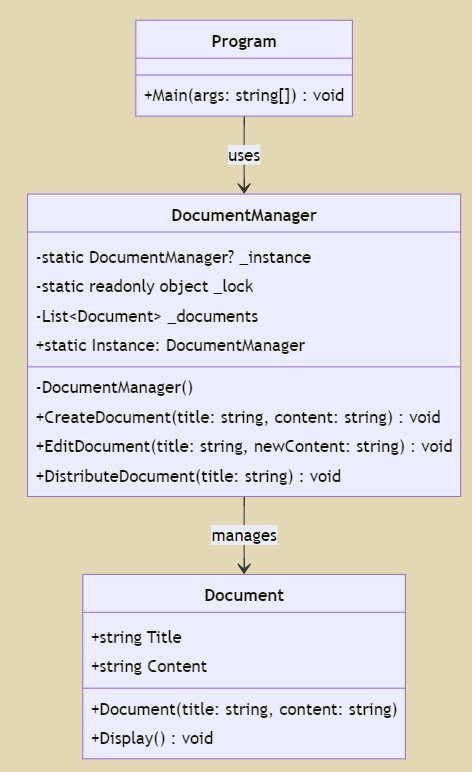

Пояснення:
Одинак забезпечує існування лише одного екземпляра DocumentManager та надає глобальну точку доступу до нього.
Безпека потоку (thread safety) використовує блокування (lock) для забезпечення потокобезпечного створення єдиного екземпляру.
Клас DocumentManager:
Методи: Створення, редагування та розповсюдження документів.
Приватний конструктор: Запобігає прямому створенню екземплярів.
Статична властивість екземпляра: Надає доступ до єдиного екземпляра.
Використання у Main:
Отримує доступ до єдиного екземпляра DocumentManager.
Створює, редагує та розповсюджує документи.
Перевіряє, що існує лише один екземпляр.

# Патерн одинак (Singleton)

- Потрібно вивчити теоретичний матеріал та написати власноруч приклад коду для патерну sigleton.
- Закомітити даний приклад та зробити pull request.
- Згідно власного варіанту потрібно переписати існуючий проект та додати за потреби нові класи. Варіанти завдань отримати у викладача.
- В README файлі навести UML діаграму класів для коду згідно власного варіанту з короткими поясненнями.
- Закомітити код та зробити pull request.

## Варіанти індивідуальних завдань
1. Реалізувати Singleton для віртуального принтера у бухгалтерській системі, який надає доступ до друку звітів про працівників, зарплати та інші фінансові документи з різних модулів системи.
2. Реалізувати Singleton для єдиного принтера в операційній системі, забезпечуючи централізований доступ до друку з будь-якого додатка або служби системи.
3. Розробити Singleton для кошика покупця на сайті магазину, що забезпечує унікальний і постійний доступ до кошика з будь-якої частини сайту.
4. Реалізувати Singleton для логування дій у текстові файли, який фіксує всі операції різних методів усередині додатку.
5. Створити систему логування для лабораторної роботи з патерном Будівельник, використовуючи Singleton для збереження логів у файл.
6. Реалізувати Singleton для системи управління налаштуваннями користувача в додатку, що забезпечує централізований доступ до налаштувань, незалежно від того, з якого пристрою він входить у систему.
7. Реалізувати Singleton для доступу до конфігураційних даних програми, забезпечуючи централізований доступ до налаштувань бази даних, портів та ключів API.
8. Розробити Singleton для системи бронювання місць в потягу, що забезпечує централізований доступ до управління резерваціями.
9. Реалізувати Singleton для управління командами в програмі, де кожна команда є унікальною і її стан відстежується централізовано.
10. Створити Singleton для одночасної роботи різних користувачів на одному веб-сайті, забезпечуючи синхронізацію їхніх дій без конфліктів.
11. Розробити Singleton для збереження параметрів авторизації користувачів на різних ресурсах, забезпечуючи безпечний та централізований доступ до цих даних.
12. Реалізувати Singleton для доступу до аудіосистеми в мобільному додатку, що дозволяє контролювати відтворення звуку централізовано.
13. Розробити Singleton для віртуального PDF принтера у університетській системі, який надає можливість створення PDF-документів з різних академічних джерел.
14. Створити Singleton для системи документообігу, що забезпечує централізований доступ до створення, редагування та розподілу документів в організації.
15. Розробити Singleton для логування з використанням легковаговика, який забезпечує ефективне зберігання логів з мінімальним споживанням ресурсів.
16. Створити Singleton для управління логами у складній системі адаптерів, де потрібно вести облік взаємодій різних систем і компонентів.
17. Розробити Singleton для управління відеоконференціями, забезпечуючи централізований контроль за підключеннями та передачею даних.
18. Створити Singleton для централізованого керування ігровими сесіями на онлайн платформі, де кожна сесія управляється єдиним інстансом.
19. Реалізувати Singleton для системи моніторингу домашньої автоматизації, який контролює всі пристрої та сенсори в будинку.
20. Розробити Singleton для керування замовленнями в онлайн ресторані, де всі замовлення обробляються та відстежуються через єдиний інтерфейс.
21. Створити Singleton для централізованого управління бібліотекою цифрових ресурсів, що включає книги, журнали та інші публікації.
22. Реалізувати Singleton для управління подіями у великому корпоративному календарі, що синхронізує події для всіх співробітників.
23. Створити Singleton для системи відстеження запасів на складі, яка регулює рівень запасів і використання матеріалів.
24. Розробити Singleton для централізованої системи зв'язку в медичній установі, що включає обмін медичними даними між відділеннями.
25. Реалізувати Singleton для системи збору та аналізу трафіку на корпоративному веб-сайті, яка забезпечує збір даних з різних джерел і їх аналіз.
